<h2>TensorFlow-FlexUNet-Image-Segmentation-CoBrA-Hippocampal-Subfield-T2W (2026/04/09)</h2>
Sarah T. Arai 
Software Laboratory antillia.com  
This is the first experiment of Image Segmentation for <b>CoBrA-Hippocampus-Subfield-T2W</b>
 based on 
our <a href="./src/TensorFlowFlexUNet.py">TensorFlowFlexUNet</a>
 (<b>TensorFlow Flexible UNet Image Segmentation Model for Multiclass</b>), and a 512x512 pixels PNG
 <a href="https://drive.google.com/file/d/1vHh9VDAIwcrbrr3P2skNLXQWQ7cckVH5/view?usp=sharing">
CoBrA-Hippocampus-Subfield-T2W-ImageMask-Dataset.zip</a> 
(<a href="https://creativecommons.org/licenses/by-nc-sa/4.0/">
CC BY-NC-SA 4.0</a>), which was derived by us from   
<a href="https://cobralab.net/files/brains_t2.tar.bz2">Hippocampus-subfields(T2-Weighted)</a></b>
in <a href="http://cobralab.ca/atlases/Hippocampus-subfields/">MRI-Based Digital Brain Atlases</a> and 
  
<a href="https://github.com/CoBrALab/atlases/tree/master/hippocampus-subfields"><b>hippocampus-subfields/labels</b></a> in 
<a href="https://github.com/CoBrALab/atlases">
<b>Expertly segmented structures on high resolution T1 and T2 human brain scans</b>
</a>
  

<b>Actual Image Segmentation for CoBrA-Hippocampus-Subfield-T2W Images of 512x512 pixels</b> 
As shown below, the inferred masks predicted by our segmentation model trained by the dataset appear similar to the 
ground truth masks.
  
<a href="#color-class-mapping-table">Hippocampus Subfield class-color mapS</a>  
<table>
<tr>
<th>Input: image</th>
<th>Mask (ground_truth)</th>
<th>Prediction: inferred_mask</th>
</tr>
<tr>
<td>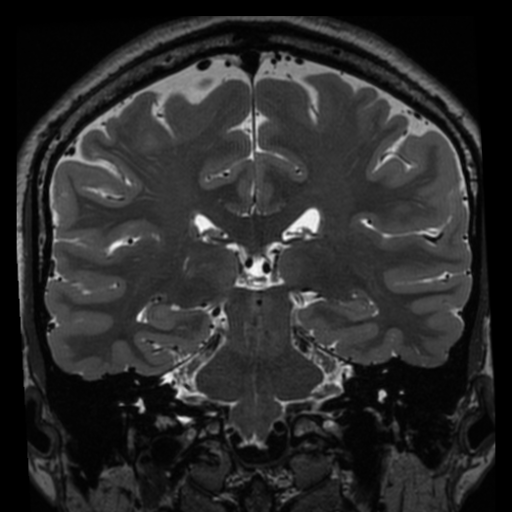</td>
<td>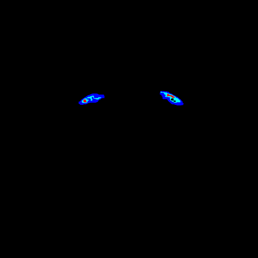</td>
<td>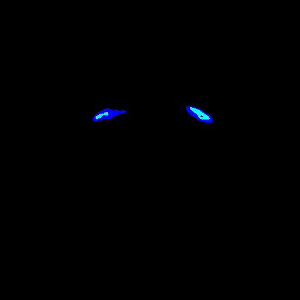</td>
</tr>

<tr>
<td>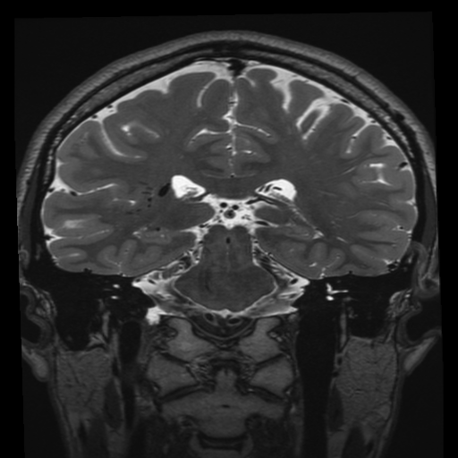</td>
<td>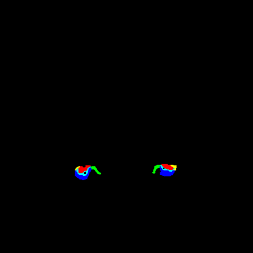</td>
<td>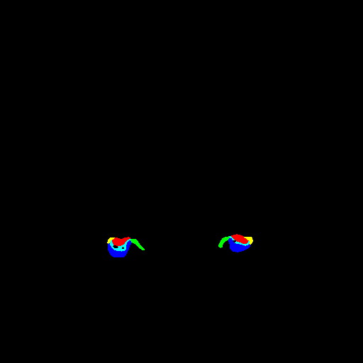</td>
</tr>

<tr>
<td>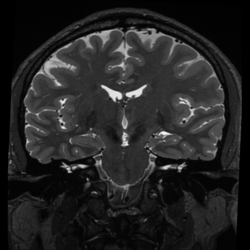</td>
<td>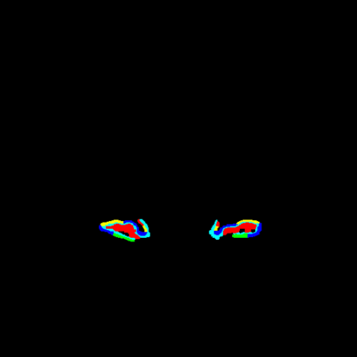</td>
<td>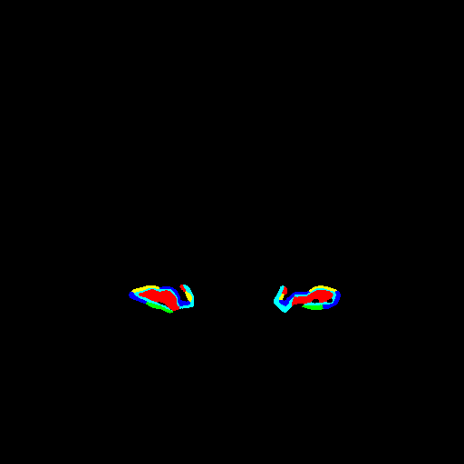</td>
</tr>
</table>

 

 
<h3>1. Dataset Citation</h3>
The dataset used here was taken from   
<a href="https://cobralab.net/files/brains_t2.tar.bz2">Hippocampus-subfields(T2-Weighted)</a></b>
in <a href="http://cobralab.ca/atlases/Hippocampus-subfields/">MRI-Based Digital Brain Atlases</a> and 
 
<a href="https://github.com/CoBrALab/atlases/tree/master/hippocampus-subfields"><b>hippocampus-subfields/labels</b></a> in 
<a href="https://github.com/CoBrALab/atlases">
<b>Expertly segmented structures on high resolution T1 and T2 human brain scans</b>
</a>
  
The following explanation was taken from <a href="https://github.com/CoBrALab/atlases/blob/master/hippocampus-subfields/README.md">
Whole Hippocampus Atlas
</a>
  
These atlases, and the manual segmentation protocol used to produce them are described in:
 
<pre>
Winterburn JL, Pruessner JC, Chavez S, et al. A novel in vivo atlas of
human hippocampal subfields using high-resolution 3 T magnetic resonance
imaging.  Neuroimage. 2013;74:254-65.
</pre>
 
To obtain the subject T1 and T2 images for these labels, or for more information, please visit:
<a href="http://cobralab.ca/atlases/Hippocampus-subfields/">http://cobralab.ca/atlases/Hippocampus-subfields/</a>
  
<b>Labels</b>
<pre>
Label: 1   - right CA1
Label: 2   - right subiculum
Label: 4   - right CA4/dentate gyrus
Label: 5   - right CA2/CA3
Label: 6   - right stratum radiatum/stratum lacunosum/stratum moleculare
Label: 101 - left CA1
Label: 102 - left subiculum
Label: 104 - left CA4/dentate gyrus
Label: 105 - left CA2/CA3
Label: 106 - left stratum radiatum/stratum lacunosum/stratum moleculare
</pre>
<b>License</b> 
(<a href="https://creativecommons.org/licenses/by-nc-sa/4.0/">
Attribution-NonCommercial-ShareAlike 4.0 International (CC BY-NC-SA 4.0</a>)
 
 
<h3>
<a id="2">
2 CoBrA-Hippocampus-Subfield-T2W ImageMask Dataset
</a>
</h3>
<h3>2.1 Download ImageMask Dataset</h3>
 If you would like to train this CoBrA-Hippocampus-Subfield-T2W Segmentation model by yourself,
 please download the dataset from the google drive  
 <a href="https://drive.google.com/file/d/1vHh9VDAIwcrbrr3P2skNLXQWQ7cckVH5/view?usp=sharing">
CoBrA-Hippocampus-Subfield-T2W-ImageMask-Dataset.zip</a> 
(<a href="https://creativecommons.org/licenses/by-nc-sa/4.0/">
CC BY-NC-SA 4.0</a>)
, expand the downloaded ImageMaskDataset and put it under <b>./dataset</b> folder to be
 
<pre>
./dataset
└─CoBrA-Hippocampus-Subfield-T2W
    ├─test
    │   ├─images
    │   └─masks
    ├─train
    │   ├─images
    │   └─masks
    └─valid
        ├─images
        └─masks
</pre>
 
<b>CoBrA-Hippocampus-Subfield-T2W Statistics</b> 
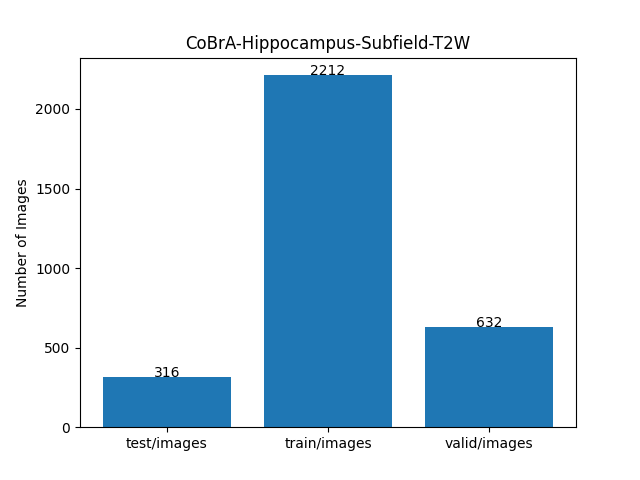 
  
As shown above, the number of images of train and valid datasets is not so large to use for the
 training set of our segmentation model.
  
<h3>2.2 Derivation of CoBrA-Hippocampus-Subfield-T2W </h3>
Firstly, please clone the orginal github repository <a href="https://github.com/CoBrALab/atlases">CoBrALab atlases</a> 
to your local folder. 
Secondly, please download <a href="https://cobralab.net/files/brains_t2.tar.bz2">brain_t2.tar.bz2</a>, expand the downloaded,
and put it under <b>/atlases/hippocampus-subfields</b> of your local repository.
The folder structure of your local <b>atlases</b> folder will become the following.  
<pre>
./atlases
└─hippocampus-subfields
     ├─brains_t2
     │   ├─brain1_t2.mnc
     │   ├─brain2_t2.mnc
     │   ├─brain3_t2.mnc
     │   ├─brain4_t2.mnc
     │   └─brain5_t2.mnc
     └─labels
          ├─brain1_labels.mnc
          ├─brain2_labels.mnc
          ├─brain3_labels.mnc
          ├─brain4_labels.mnc
          └─brain5_labels.mnc
...
</pre>
We used a Python script and the following class-color mapping table to generate our PNG dataset with colorized masks
from <b>brain*_t2.mnc </b> and  <b>brain*_labels.mnc</b> files.
  
<a id="color-class-mapping-table"><b>Hippocampus Subfield class-color map</b></a>
  
<table border=1 style='border-collapse:collapse;' cellpadding='5'>
<tr><th>Indexed Color</th><th>Color</th><th>RGB</th><th>Class</th></tr>
<tr><td>1</td><td with='80' height='auto'></td><td>(0, 0, 255)</td><td>CA1</td></tr>
<tr><td>2</td><td with='80' height='auto'></td><td>(0, 255, 0)</td><td>Subiculum</td></tr>
<tr><td>4</td><td with='80' height='auto'></td><td>(255, 0, 0)</td><td>CA4-DG</td></tr>
<tr><td>5</td><td with='80' height='auto'></td><td>(255, 255, 0)</td><td>CA2-CA3</td></tr>
<tr><td>6</td><td with='80' height='auto'></td><td>(0, 255, 255)</td><td>Stratum</td></tr>
</table>
 
 
<h3>2.3 Train Image and SmoothedMask Saｍples</h3>
<b>Train_images_sample</b> 
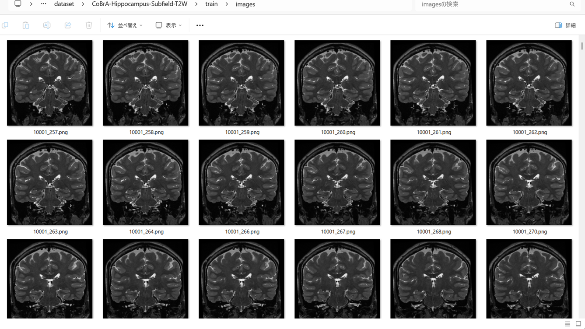
 
<b>Train_masks_sample</b> 
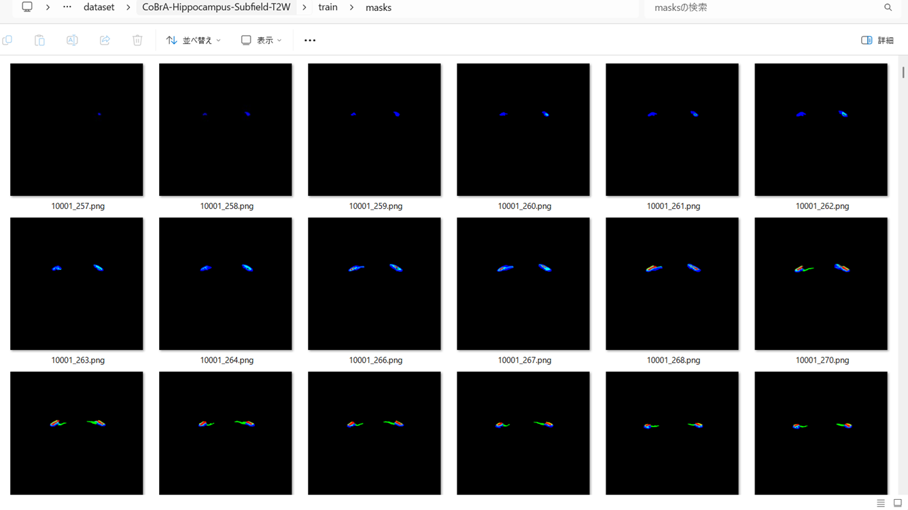
 
<h3>
3 Train TensorFlowFlexUNet Model
</h3>
 We trained CoBrA-Hippocampus-Subfield-T2W TensorFlowFlexUNet Model by using the 
<a href="./projects/TensorFlowFlexUNet/CoBrA-Hippocampus-Subfield-T2W/train_eval_infer.config"> <b>train_eval_infer.config</b></a> file.  
Please move to ./projects/TensorFlowFlexUNet/CoBrA-Hippocampus-Subfield-T2W and run the following bat file. 
<pre>
>1.train.bat
</pre>
, which simply runs the following command. 
<pre>
>python ../../../src/TensorFlowFlexUNetTrainer.py ./train_eval_infer.config
</pre>

<b>Model parameters</b> 
Defined a small <b>base_filters = 16 </b> and large <b>base_kernels = (11,11)</b> for the first Conv Layer of Encoder Block of 
<a href="./src/TensorFlowFlexUNet.py">TensorFlowFlexUNet.py</a> 
and a large num_layers (including a bridge between Encoder and Decoder Blocks).
<pre>
[model]
;You may specify your own UNet class derived from our TensorFlowFlexModel
model         = "TensorFlowFlexUNet"
image_width    = 512
image_height   = 512
image_channels = 3
input_normalize = True
normalization  = False
num_classes    = 6
base_filters   = 16
base_kernels   = (11,11)
num_layers     = 8
dropout_rate   = 0.04
dilation       = (1,1)
</pre>
<b>Learning rate</b> 
Defined a small learning rate.  
<pre>
[model]
learning_rate  = 0.00007
</pre>
<b>Loss and metrics functions</b> 
Specified "categorical_crossentropy" and <a href="./src/dice_coef_multiclass.py">"dice_coef_multiclass"</a>. 
<pre>
[model]
loss           = "categorical_crossentropy"
metrics        = ["dice_coef_multiclass"]
</pre>
<b>Dataset class</b> 
Specifed <a href="./src/ImageCategorizedMaskDataset.py">ImageCategorizedMaskDataset</a> class. 
<pre>
[dataset]
class_name    = "ImageCategorizedMaskDataset"
</pre>
 
<b>Learning rate reducer callback</b> 
Enabled learing_rate_reducer callback, and a small reducer_patience.
<pre> 
[train]
learning_rate_reducer = True
reducer_factor     = 0.4
reducer_patience   = 4
</pre>
<b>Early stopping callback</b> 
Enabled early stopping callback with patience parameter.
<pre>
[train]
patience      = 10
</pre>
<b>RGB Color map</b> 
Specifed rgb color map dict for CoBrA-Hippocampus-Subfield-T2W 1+5 classes. 
<pre>
[mask]
mask_datatyoe    = "categorized"
mask_file_format = ".png"
;CoBrA-Hippocampus-Subfield-T2W rgb color map dict for 1+5 classes.
;                        blue,     green,    red           yellow,      cyan,        
rgb_map = {(0,0,0):0,(0,0,255):1,(0,255,0):2,(255,0,0):3, (255,255,0):4,(0,255,255):5,}
</pre>
<b>Epoch change inference callback</b> 
Enabled <a href="./src/EpochChangeInferencer.py">epoch_change_infer callback</a></b>. 
<pre>
[train]
epoch_change_infer       = True
epoch_change_infer_dir   =  "./epoch_change_infer"
num_infer_images         = 6
</pre>
By using this callback, on every epoch_change, the inference procedure can be called
 for 6 images in <b>mini_test</b> folder. This will help you confirm how the predicted mask changes 
 at each epoch during your training process.  
  
As shown below, early in the model training, the predicted masks from our UNet segmentation model showed 
discouraging results.
 However, as training progressed through the epochs, the predictions gradually improved. 
   
 
<b>Epoch_change_inference output at starting (epoch 1,2,3)</b> 
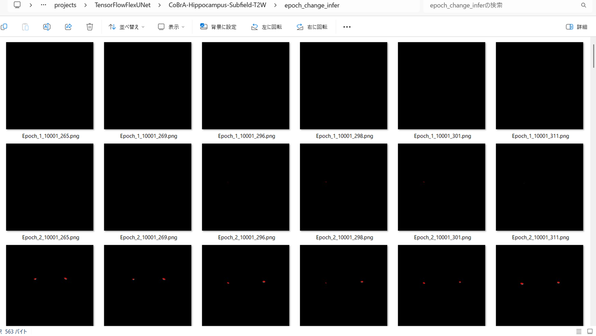 
 
<b>Epoch_change_inference output at middlepoint (epoch 46,47,48)</b> 
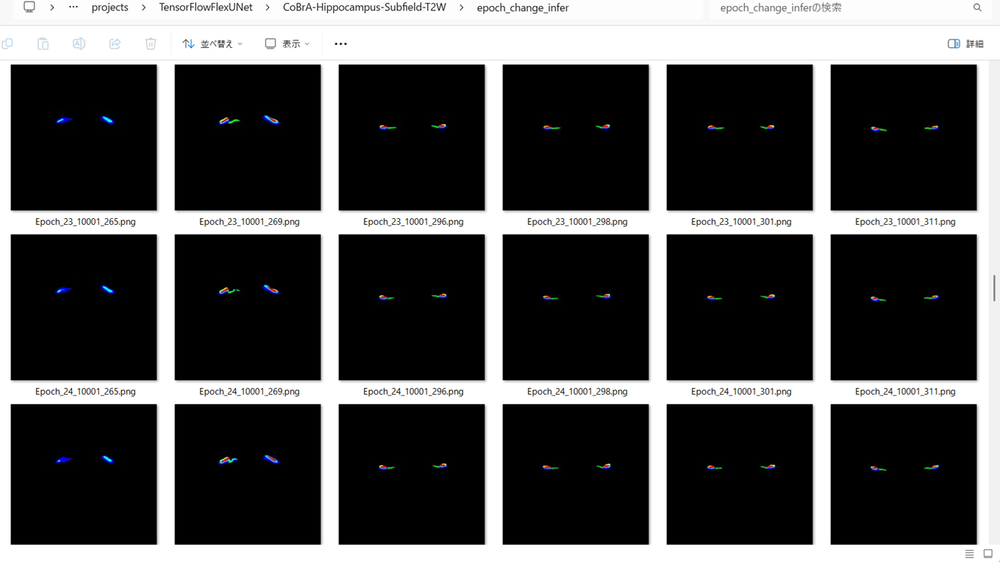 
 

<b>Epoch_change_inference output at ending (epoch 94,95,96)</b> 
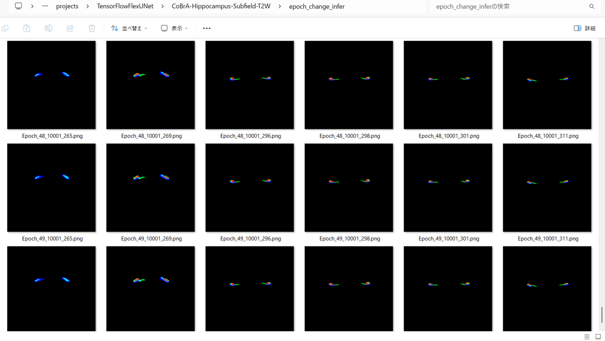 
 

In this experiment, the training process was terminated at epoch 50.  
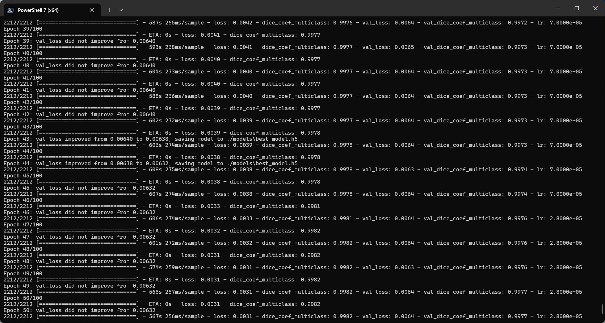 
 

<a href="./projects/TensorFlowFlexUNet/CoBrA-Hippocampus-Subfield-T2W/eval/train_metrics.csv">train_metrics.csv</a> 
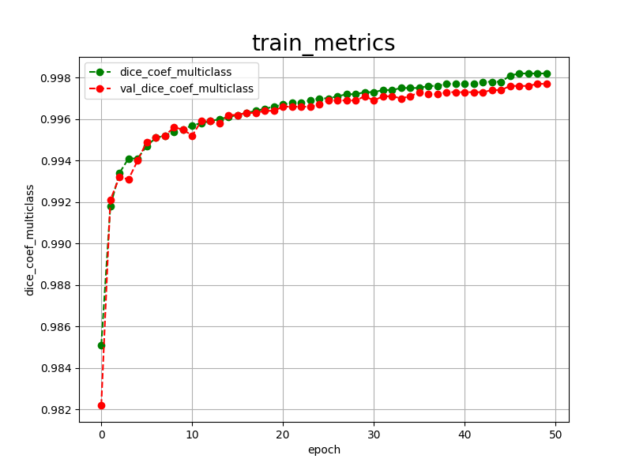 

 
<a href="./projects/TensorFlowFlexUNet/CoBrA-Hippocampus-Subfield-T2W/eval/train_losses.csv">train_losses.csv</a> 
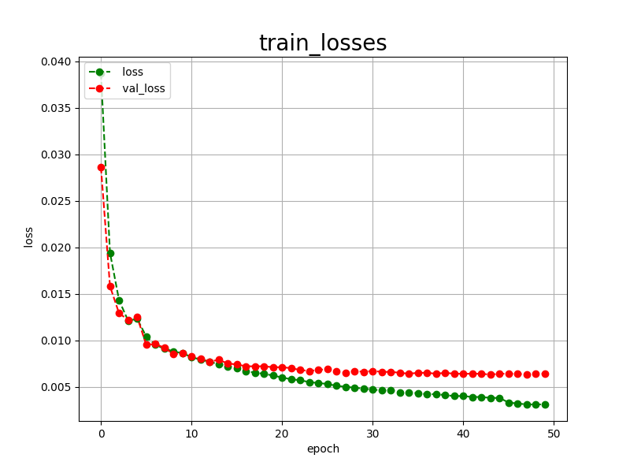 
 
<h3>
4 Evaluation
</h3>
Please move to <b>./projects/TensorFlowFlexUNet/CoBrA-Hippocampus-Subfield-T2W</b> folder, 
and run the following bat file to evaluate TensorFlowUNet model for CoBrA-Hippocampus-Subfield-T2W. 
<pre>
./2.evaluate.bat
</pre>
This bat file simply runs the following command.
<pre>
python ../../../src/TensorFlowFlexUNetEvaluator.py ./train_eval_infer_aug.config
</pre>

Evaluation console output: 
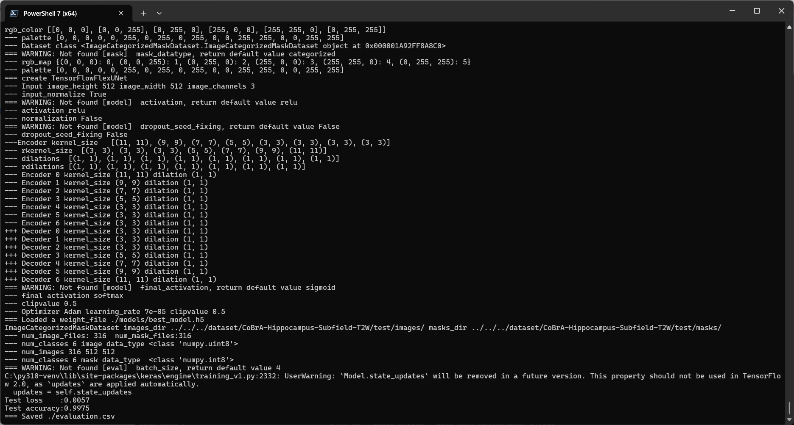
  Image-Segmentation-CoBrA-Hippocampus-Subfield-T2W

<a href="./projects/TensorFlowFlexUNet/CoBrA-Hippocampus-Subfield-T2W/evaluation.csv">evaluation.csv</a> 
The loss (categorical_crossentropy) to this <b>CoBrA-Hippocampus-Subfield-T2W/test</b> was very low, and dice_coef_multiclass very high as shown below.
 
<pre>
categorical_crossentropy,0.0057
dice_coef_multiclass,0.9975
</pre>
 
<h3>
5 Inference
</h3>
Please move to a <b>./projects/TensorFlowFlexUNet/CoBrA-Hippocampus-Subfield-T2W</b> folder, and run the following bat file to infer segmentation regions for images by the Trained-TensorFlowUNet model for CoBrA-Hippocampus-Subfield-T2W. 
<pre>
./3.infer.bat
</pre>
This simply runs the following command.
<pre>
python ../../../src/TensorFlowFlexUNetInferencer.py ./train_eval_infer_aug.config
</pre>

<b>mini_test_images</b> 
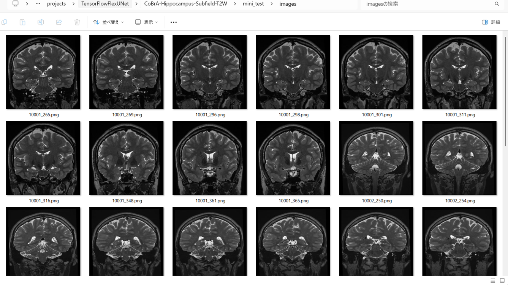 
<b>mini_test_mask(ground_truth)</b> 
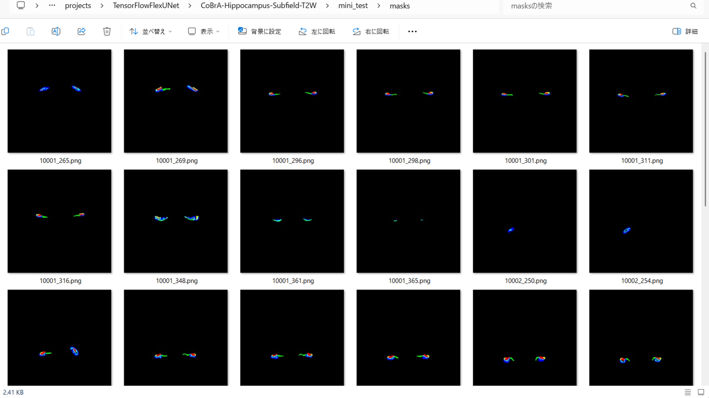 

<b>Inferred test masks</b> 
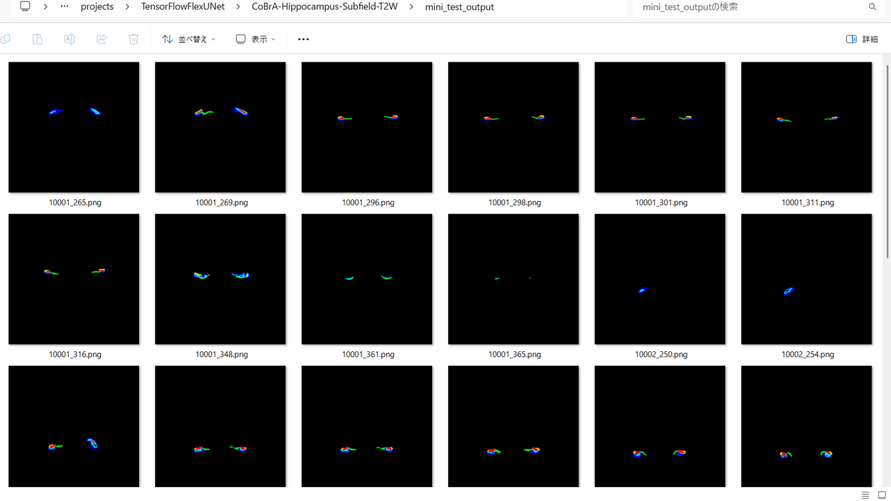 
 

<b>Enlarged images and masks of CoBrA-Hippocampus-Subfield-T2W Images of 512x512 pixels</b> 
As shown below, the inferred masks predicted by our segmentation model trained by the dataset appear similar to the
ground truth masks.
  
<a href="#color-class-mapping-table">Hippocampus Subfield class-color mapS</a>  
  
<table>
<tr>
<th>Input:Image</th>
<th>Mask (ground_truth)</th>
<th>Prediction:Inferred-mask</th>
</tr>
<tr>
<td>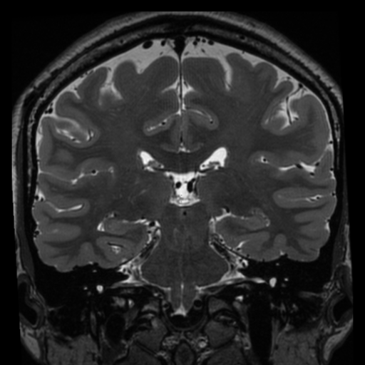</td>
<td>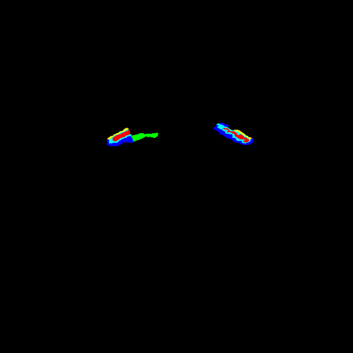</td>
<td>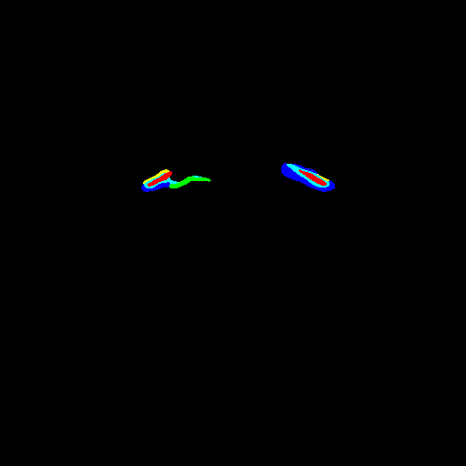</td>
</tr>

<tr>
<td>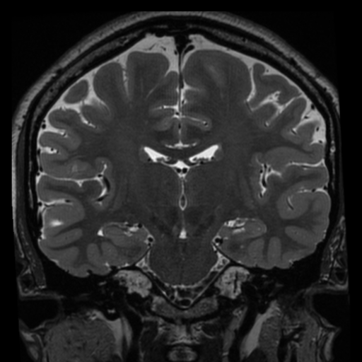</td>
<td>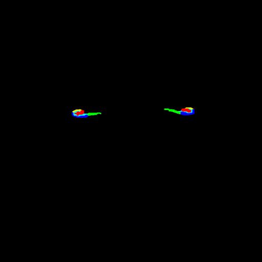</td>
<td>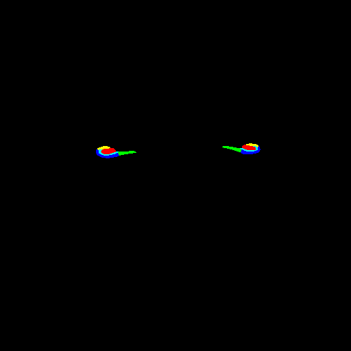</td>
</tr>

<tr>
<td>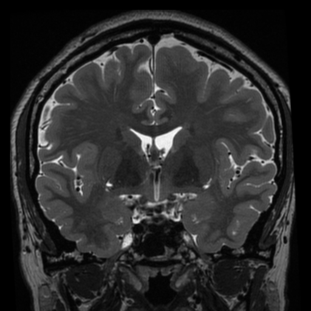</td>
<td>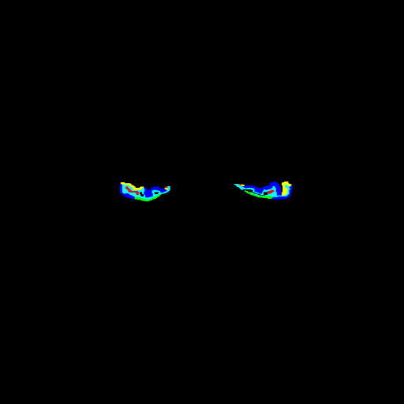</td>
<td>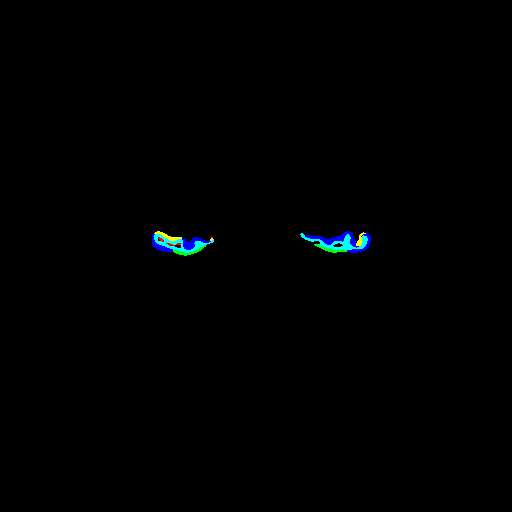</td>
</tr>

<tr>
<td>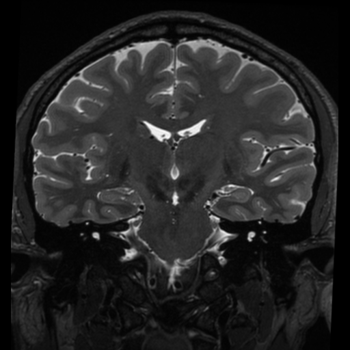</td>
<td>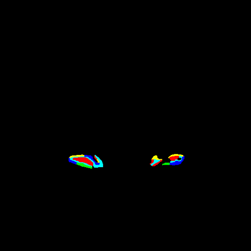</td>
<td>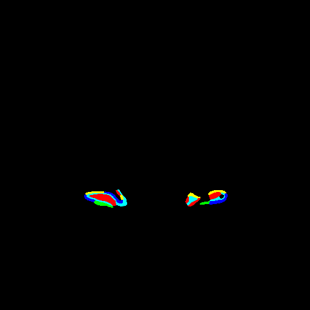</td>
</tr>

<tr>
<td>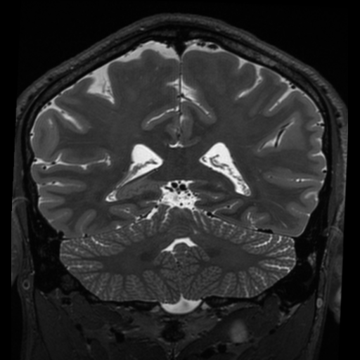</td>
<td>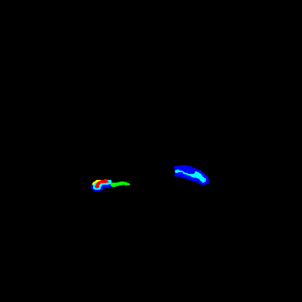</td>
<td>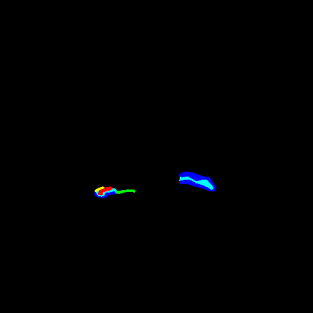</td>
</tr>

<tr>
<td>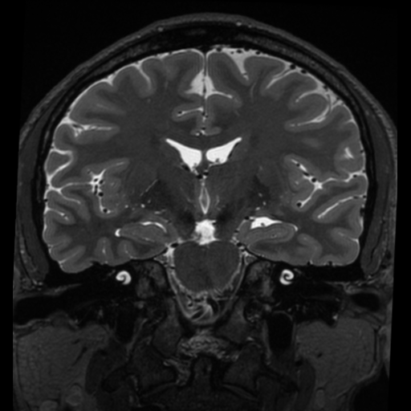</td>
<td>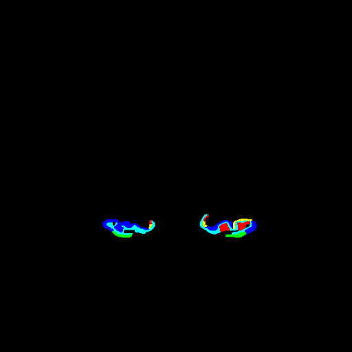</td>
<td>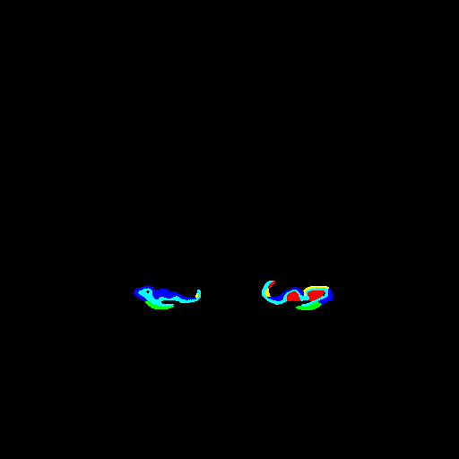</td>
</tr>
</table>

 
<h3>
References
</h3>
<b>1. Multi-contrast submillimetric 3 Tesla hippocampal subfield segmentation protocol and dataset</b> 
Jessie Kulaga-Yoskovitz, Boris C. Bernhardt, Seok-Jun Hong, Tommaso Mansi, Kevin E. Liang,  
Andre J.W. van der Kouwe, Jonathan Smallwood, Andrea Bernasconi & Neda Bernasconi 
<a href="https://www.nature.com/articles/sdata201559">https://www.nature.com/articles/sdata201559</a>
  
<b>2. A paired dataset of multi-modal MRI at 3 Tesla and 7 Tesla with manual hippocampal subfield segmentations</b> 
Lei Chu, Baoqiang Ma, Xiaoxi Dong, Yirong He, Tongtong Che, Debin Zeng, Zihao Zhang & Shuyu Li 
<a href="https://www.nature.com/articles/s41597-025-04586-9?fromPaywallRec=false">
https://www.nature.com/articles/s41597-025-04586-9?fromPaywallRec=false</a>
  
<b>3. A novel deep learning based hippocampus subfield segmentation method</b> 
JoséV. Manjón, José E. Romero & Pierrick Coupe 
<a href="https://www.nature.com/articles/s41598-022-05287-8.pdf">https://www.nature.com/articles/s41598-022-05287-8.pdf</a>
  
<b>4. DSnet: a new dual‑branch network for hippocampus subfield segmentation</b> 
Hancan Zhu, Wangang Cheng, Keli Hu & Guanghua He 
<a href="https://www.researchgate.net/publication/381961150_DSnet_a_new_dual-branch_network_for_hippocampus_subfield_segmentation">
https://www.researchgate.net/publication/381961150_DSnet_a_new_dual-branch_network_for_hippocampus_subfield_segmentation</a>
  
<b>5. TensorFlow-FlexUNet-Image-Segmentation-Model</b> 
Toshiyuki Arai  
<a href="https://github.com/sarah-antillia/TensorFlow-FlexUNet-Image-Segmentation-Model">
TensorFlow-FlexUNet-Image-Segmentation-Model
</a>
 
 
